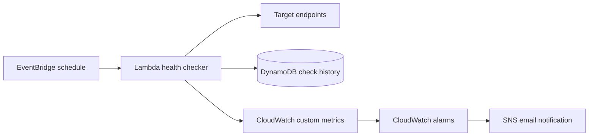

# Serverless Uptime Monitor

A scheduled, serverless health-check service for monitoring HTTP endpoints and notifying operators when availability or latency thresholds are breached.

## Architecture



## Features

- Multiple endpoint checks from configuration
- Status-code and latency validation
- CloudWatch metrics per monitored service
- DynamoDB history with automatic TTL expiry
- SNS alerts from CloudWatch alarms
- Least-privilege IAM and encrypted notifications
- Configurable schedule and disabled-by-default deployment switch
- AWS SAM, unit tests, and CI validation

## Safe deployment

The monitoring schedule is disabled by default. Review the template, supply endpoints you control, set `ScheduleEnabled` to `true`, and deploy:

```bash
sam build
sam deploy --guided
```

Confirm the SNS email subscription before alerts can arrive. Do not monitor third-party endpoints without permission.

## Cost controls

The check runs every five minutes only when enabled, uses a 128 MB Lambda, retains logs for seven days, and expires DynamoDB history after seven days. Create an AWS Budget and billing alert first. Free-tier eligibility varies by account and region.

## Teardown

```bash
sam delete
```

## Skills demonstrated

AWS Lambda, EventBridge Scheduler, CloudWatch metrics and alarms, SNS, DynamoDB TTL, AWS SAM, Python, SRE monitoring concepts, IAM, testing, and CI/CD.
